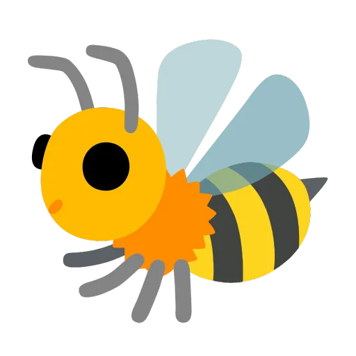

<!-- Improved compatibility of back to top link: See: url]: https://github.com/bee6-bot/bee6/pull/73 -->
<a name="readme-top"></a>
<!--
*** Thanks for checking out the Best-README-Template. If you have a suggestion
*** that would make this better, please fork the repo and create a pull request
*** or simply open an issue with the tag "enhancement".
*** Don't forget to give the project a star!
*** Thanks again! Now go create something AMAZING! :D
-->

# This repository will no longer be updated!
> BEE6's development is now happening [here](https://github.com/bee6-bot/bee6).

----

<!-- PROJECT SHIELDS -->
<!--
*** I'm using markdown "reference style" links for readability.
*** Reference links are enclosed in brackets [ ] instead of parentheses ( ).
*** See the bottom of this document for the declaration of the reference variables
*** for contributors-url, forks-url, etc. This is an optional, concise syntax you may use.
*** https://www.markdownguide.org/basic-syntax/#reference-style-links
-->
[![Contributors][contributors-shield]][contributors-url]
[![Forks][forks-shield]][forks-url]
[![Stargazers][stars-shield]][stars-url]
[![Issues][issues-shield]][issues-url]
[![MIT License][license-shield]][license-url]


<!-- PROJECT LOGO -->
<br />
<div align="center">
  <a href="https://github.com/bee6-bot/bee6">
    
  </a>

<h3 align="center">BEE6</h3>

  <p align="center">
    The versatile and feature-packed Discord bot
    <br />
    <a href="https://bee6-bot.github.io/user-docs/bee6/welcome"><strong>Explore the user docs »</strong></a>
    <br />
    <br />
    <a href="https://github.com/bee6-bot/bee6/issues">Report Bug</a>
    • <a href="https://github.com/bee6-bot/bee6/issues">Request Feature</a>
  </p>
</div>


<!-- TABLE OF CONTENTS -->
<details>
<summary>Table of Contents</summary>

<!-- TOC -->
  * [About The Project](#about-the-project)
    * [What does BEE6 have to offer?](#what-does-bee6-have-to-offer)
    * [Built With](#built-with)
  * [Getting Started](#getting-started)
    * [Prerequisites](#prerequisites)
    * [Installation](#installation)
  * [Usage](#usage)
  * [Contributing](#contributing)
  * [License](#license)
  * [Contact](#contact)
  * [Acknowledgments](#acknowledgments)
<!-- TOC -->

</details>


<!-- ABOUT THE PROJECT -->

## About The Project

[//]: # ([![Product Name Screen Shot][product-screenshot]]&#40;https://example.com&#41;)

Welcome to BEE6, the versatile and feature-packed Discord bot designed to cater to all your server's needs. As a free
and open-source alternative to MEE6 and other popular bots, BEE6 offers a wide range of functionalities to elevate your
Discord server to the next level.

### What does BEE6 have to offer?

⚠️ Coming soon • 🚧 In progress • ✅ Implemented


- ✅ **Customizable** • BEE6 is designed to be as customisable as possible, with a wide range of settings and options to
  suit your needs. [Check some of them out here](https://bee6-bot.github.io/user-docs/bee6/configs).
- ✅ **Welcome/leave messages** • BEE6 can send welcome and leave messages to your server's channels, with a wide range of
  customization options.
- ✅ **Leveling** • BEE6 can track your server's members' activity, **plus** has a feature to easily migrate your
    leveling data from MEE6.
- ✅ **Economy** • Members can earn currency by being active and use it to purchase items and play games.
- ✅ **AI Chatbot** • BEE6 can chat with your server's members using OpenAI's GPT-3.5 Turbo.
- 🚧 **Reaction Roles** • BEE6 can assign roles to users when they react to a message.
- 🚧 **Auto-moderation** • BEE6 can automatically moderate your server, with a wide range of options to suit your needs.
- ⚠️ **Auto-role** • BEE6 can automatically assign roles to new members.
- ⚠️ **Social Media Alerts** • BEE6 can send alerts to your server when you or someone else posts on social media.
- ⚠️ **Custom Commands** • BEE6 can create custom commands for your server.

<p align="right">(<a href="#readme-top">back to top</a>)</p>

### Built With

[![Node.js][Node.js]][Node-url]
[![MongoDB][MongoDB]][MongoDB-url]
[![Discord.js][Discord.js]][Discord.js-url]
[![Express.js][Express.js]][Express.js-url]

<p align="right">(<a href="#readme-top">back to top</a>)</p>


<!-- GETTING STARTED -->

## Getting Started


### Prerequisites

* Node.js
* NPM
* MongoDB
* A Discord bot

### Installation

1. Clone the repo
   ```sh
   git clone https://github.com/bee6-bot/bee6.git
   ```
2. Install NPM packages
   ```sh
   npm install
   ```
3. Enter your credentials and settings in `example.env`, and rename it to `.env`

<p align="right">(<a href="#readme-top">back to top</a>)</p>


<!-- USAGE EXAMPLES -->

## Usage

```sh
npm run start
```

<p align="right">(<a href="#readme-top">back to top</a>)</p>


<!-- ROADMAP -->

[//]: # (## Roadmap)

[//]: # ()
[//]: # (- [x] Add Changelog)

[//]: # (- [x] Add back to top links)

[//]: # (- [ ] Add Additional Templates w/ Examples)

[//]: # (- [ ] Add "components" document to easily copy & paste sections of the readme)

[//]: # (- [ ] Multi-language Support)

[//]: # (    - [ ] Chinese)

[//]: # (    - [ ] Spanish)

[//]: # ()
[//]: # (See the [open issues]&#40;url]: https://github.com/bee6-bot/bee6/issues&#41; for a full list of proposed features &#40;and known)

[//]: # (issues&#41;.)

[//]: # ()
[//]: # (<p align="right">&#40;<a href="#readme-top">back to top</a>&#41;</p>)


<!-- CONTRIBUTING -->

## Contributing

Contributions are what make the open source community such an amazing place to learn, inspire, and create. Any
contributions you make are **greatly appreciated**.

If you have a suggestion that would make this better, please fork the repo and create a pull request. 
You can also simply open an issue with the tag "enhancement" if you have an idea but don't know how to implement it.

1. Fork the Project
2. Create your Feature Branch (`git checkout -b feature/flower-detection`)
3. Commit your Changes (`git commit -m 'Add flower detection so BEES can pollinate'`)
4. Push to the Branch (`git push origin feature/flower-detection`)
5. Open a Pull Request

<p align="right">(<a href="#readme-top">back to top</a>)</p>


<!-- LICENSE -->

## License

Distributed under the MIT License. See [`LICENSE`](LICENSE) for more information.

<p align="right">(<a href="#readme-top">back to top</a>)</p>


<!-- CONTACT -->

## Contact

- **BeauTheBeau** • [Email](mailto:beau@beauthebeau.pro)
    • [Email 2](mailto:beauthebeau@skiff.com)
    • [Discord](https://discord.com/users/729567972070391848)
    • [X](https://x.com/@beauthebeau1)

- **Project Link** 
    • [GitHub](https://github.com/bee6-bot/bee6)
    • [User Docs](https://bee6-bot.github.io/user-docs/bee6/)

<p align="right">(<a href="#readme-top">back to top</a>)</p>


<!-- ACKNOWLEDGMENTS -->

## Acknowledgments

* [Best README Template](https://github.com/othneildrew/Best-README-Template)
* [Img Shields](https://shields.io)
* [GitHub Pages](https://pages.github.com)

<p align="right">(<a href="#readme-top">back to top</a>)</p>


<!-- MARKDOWN LINKS & IMAGES -->
<!-- https://www.markdownguide.org/basic-syntax/#reference-style-links -->

[contributors-shield]: https://img.shields.io/github/contributors/bee6-bot/bee6.svg?style=for-the-badge
[contributors-url]: https://github.com/bee6-bot/bee6/graphs/contributors

[forks-shield]: https://img.shields.io/github/forks/bee6-bot/bee6.svg?style=for-the-badge
[forks-url]: https://github.com/bee6-bot/bee6/network/members

[stars-shield]: https://img.shields.io/github/stars/bee6-bot/bee6.svg?style=for-the-badge
[stars-url]: https://github.com/bee6-bot/bee6/stargazers

[issues-shield]: https://img.shields.io/github/issues/bee6-bot/bee6.svg?style=for-the-badge
[issues-url]: https://github.com/bee6-bot/bee6/issues

[license-shield]: https://img.shields.io/github/license/bee6-bot/bee6.svg?style=for-the-badge
[license-url]: https://github.com/bee6-bot/bee6/blob/master/LICENSE.txt

[github-repo]: https://github.com/bee6-bot/bee6

[Next.js]: https://img.shields.io/badge/next.js-000000?style=for-the-badge&logo=nextdotjs&logoColor=white
[Next-url]: https://nextjs.org/

[Node.js]: https://img.shields.io/badge/node.js-339933?style=for-the-badge&logo=nodedotjs&logoColor=white
[Node-url]: https://nodejs.org/en/

[MongoDB]: https://img.shields.io/badge/mongodb-47A248?style=for-the-badge&logo=mongodb&logoColor=white
[MongoDB-url]: https://www.mongodb.com/

[Discord.js]: https://img.shields.io/badge/discord.js-7289DA?style=for-the-badge&logo=discorddotjs&logoColor=white
[Discord.js-url]: https://discord.js.org/

[Express.js]: https://img.shields.io/badge/express.js-000000?style=for-the-badge&logo=express&logoColor=white
[Express.js-url]: https://expressjs.com/
